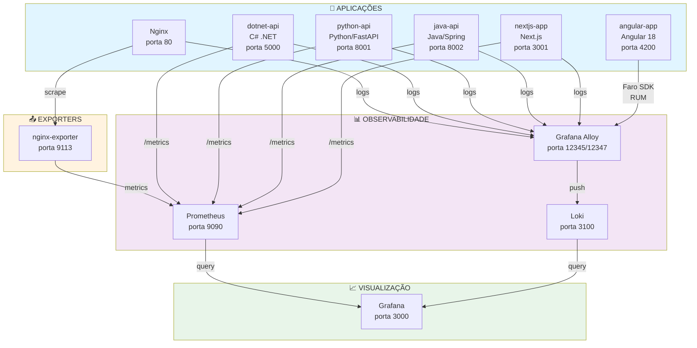

# 🔬 Laboratório de Observabilidade

> **Projeto educacional completo** sobre observabilidade moderna com Grafana, Prometheus, Loki, Alloy e OpenTelemetry em múltiplas linguagens.

[](https://www.docker.com/)
[](https://prometheus.io/)
[](https://grafana.com/)

---

## 📚 Índice

- [Sobre o Projeto](#-sobre-o-projeto)
- [Objetivos](#-objetivos)
- [Arquitetura](#-arquitetura)
- [Stack Tecnológica](#-stack-tecnológica)
- [Como Foi Construído](#-como-foi-construído)
- [Pré-requisitos](#-pré-requisitos)
- [Como Executar](#-como-executar)
- [Como Testar](#-como-testar)
- [Dashboards](#-dashboards)
- [Aprendizados](#-aprendizados)
- [Estrutura do Projeto](#-estrutura-do-projeto)
- [Métricas Coletadas](#-métricas-coletadas)
- [Logs Coletados](#-logs-coletados)
- [Próximos Passos](#-próximos-passos)
- [Referências](#-referências)

---

## 🎯 Sobre o Projeto

Este é um **laboratório completo de observabilidade** criado com propósito educacional para aprender e demonstrar conceitos modernos de monitoramento, logging e tracing de aplicações distribuídas.

O projeto implementa uma stack completa de observabilidade usando ferramentas open-source líderes de mercado (Grafana Stack) e demonstra como instrumentar aplicações em **4 linguagens diferentes** (.NET, Python, Java, Node.js) com **OpenTelemetry** e **Micrometer**.

### 🌟 Destaques

- ✅ **4 APIs em diferentes linguagens** instrumentadas para observabilidade
- ✅ **Frontend Next.js** moderno com métricas backend
- ✅ **Frontend Angular** com Real User Monitoring (Grafana Faro)
- ✅ **Stack Grafana completa** (Prometheus, Loki, Alloy, Grafana, Faro)
- ✅ **OpenTelemetry** para padronização
- ✅ **Dashboards customizados** no Grafana
- ✅ **Docker Compose** para fácil execução
- ✅ **Métricas customizadas** em todas as aplicações
- ✅ **Coleta de logs** centralizada com Loki
- ✅ **Monitoramento de experiência do usuário** com Core Web Vitals

---

## 🎓 Objetivos

### Objetivos de Aprendizado

Este laboratório foi criado para ensinar:

1. **Fundamentos de Observabilidade**
   - Diferença entre métricas, logs e traces (os 3 pilares)
   - Quando usar cada tipo de telemetria
   - Como correlacionar dados de diferentes fontes

2. **Ferramentas da Stack Grafana**
   - Prometheus: coleta e armazenamento de métricas
   - Loki: agregação e consulta de logs
   - Alloy: agente universal de coleta
   - Grafana: visualização e dashboards

3. **Instrumentação de Aplicações**
   - OpenTelemetry em .NET, Python e Node.js
   - Micrometer em Spring Boot (Java)
   - Métricas automáticas vs customizadas
   - Exporters para aplicações legadas

4. **Queries e Análise**
   - PromQL: linguagem de consulta do Prometheus
   - LogQL: linguagem de consulta do Loki
   - Criação de dashboards informativos
   - Interpretação de métricas

5. **DevOps e Infraestrutura**
   - Containerização com Docker
   - Orquestração com Docker Compose
   - Redes entre containers
   - Configuração declarativa

### Objetivos Práticos

- Criar uma stack de observabilidade funcional do zero
- Instrumentar aplicações reais em múltiplas linguagens
- Visualizar métricas e logs em tempo real
- Entender como isso funciona em produção
- Ter uma base para implementar em projetos reais

---

## 🏗️ Arquitetura



### Fluxo de Dados

**Métricas:**
1. Aplicações expõem endpoint `/metrics` (formato Prometheus)
2. Prometheus faz "scrape" (coleta) a cada 15 segundos
3. Métricas armazenadas como time-series no Prometheus
4. Grafana consulta Prometheus e exibe em dashboards

**Logs:**
1. Aplicações geram logs em arquivos ou stdout
2. Alloy monitora e coleta esses logs
3. Alloy adiciona labels e envia para Loki (push)
4. Logs indexados por labels no Loki
5. Grafana consulta Loki e exibe logs filtrados

**Frontend (Real User Monitoring):**
1. Angular app instrumentada com Faro SDK
2. SDK captura Core Web Vitals, erros, interações do usuário
3. Dados enviados para Alloy via HTTP (push na porta 12347)
4. Alloy processa e envia logs para Loki
5. Grafana exibe métricas de experiência do usuário

---

## 🛠️ Stack Tecnológica

### Observabilidade

| Ferramenta | Versão | Função | Porta |
|------------|--------|--------|-------|
| **Grafana** | latest | Visualização e dashboards | 3000 |
| **Prometheus** | latest | Coleta e armazenamento de métricas | 9090 |
| **Loki** | latest | Agregação e consulta de logs | 3100 |
| **Grafana Alloy** | latest | Agente universal de coleta (logs + RUM) | 12345, 12347 |
| **nginx-exporter** | latest | Exporter de métricas do Nginx | 9113 |

### Aplicações

| Aplicação | Tecnologia | Versão | Porta | Instrumentação |
|-----------|------------|--------|-------|----------------|
| **dotnet-api** | C# / .NET | 10.0 | 5000 | OpenTelemetry |
| **python-api** | Python / FastAPI | 3.12 | 8001 | OpenTelemetry |
| **java-api** | Java / Spring Boot | 21 | 8002 | Micrometer |
| **nextjs-app** | TypeScript / Next.js | 14 | 3001 | prom-client |
| **angular-app** | TypeScript / Angular | 18 | 4200 | Grafana Faro SDK |
| **nginx** | Nginx | latest | 8080 | stub_status |

### Infraestrutura

- **Docker** & **Docker Compose** - Containerização e orquestração
- **Alpine Linux** - Imagens base otimizadas

---

## 📖 Como Foi Construído

Este laboratório foi construído de forma **incremental** em 7 fases, cada uma com objetivos específicos de aprendizado:

### **Fase 1: Fundação - Grafana + Prometheus**
- Configuração inicial da stack
- Conexão entre Grafana e Prometheus
- Primeiro datasource
- Queries básicas em PromQL
- Conceito de targets e scrape

### **Fase 2: Logs - Nginx + Alloy + Loki**
- Instalação e configuração do Loki
- Configuração do Alloy para coleta de logs
- Leitura de arquivos de log do Nginx
- Queries em LogQL
- Diferença entre métricas e logs

### **Fase 3: Métricas - Nginx Exporter**
- Conceito de exporters
- nginx-prometheus-exporter
- Coleta de métricas de aplicações legadas
- Primeiro dashboard no Grafana
- Visualizações (Stat, Time series)

### **Fase 4: API .NET com OpenTelemetry**
- Instrumentação de aplicação .NET
- OpenTelemetry SDK
- Métricas automáticas (HTTP, Runtime, ASP.NET Core)
- Métricas customizadas com Meter e Counter
- Dockerização da aplicação
- Dashboard da API

### **Fase 5: API Python com FastAPI**
- Instrumentação Python/FastAPI
- OpenTelemetry em Python
- API REST com CRUD
- Métricas customizadas
- Comparação .NET vs Python

### **Fase 6: API Java com Spring Boot**
- Instrumentação Java/Spring Boot
- Micrometer (alternativa ao OpenTelemetry)
- Spring Boot Actuator
- Métricas de JVM
- Comparação entre frameworks

### **Fase 7: Frontend Next.js**
- Aplicação frontend moderna
- API routes com métricas
- Server-side instrumentation
- Interface visual para teste
- Stack completa (frontend + backend + observabilidade)

### **Fase 8: Angular + Grafana Faro (Real User Monitoring)**
- Observabilidade de frontend (RUM)
- Grafana Faro SDK para Angular
- Core Web Vitals (LCP, FID, CLS)
- Rastreamento de erros JavaScript
- Métricas de latência de API
- Alloy com receiver Faro para coletar dados do frontend
- Monitoramento de experiência do usuário real

---

## 📋 Pré-requisitos

- **Docker** 20.10+
- **Docker Compose** 2.0+
- **Git**
- **4GB RAM** disponível (mínimo)
- **10GB** de espaço em disco

### Instalação dos Pré-requisitos

**Linux/WSL:**
```bash
# Docker
curl -fsSL https://get.docker.com -o get-docker.sh
sh get-docker.sh

# Docker Compose (já incluído no Docker moderno)
docker compose version
```

**Windows:**
- Instalar [Docker Desktop](https://www.docker.com/products/docker-desktop)

**macOS:**
- Instalar [Docker Desktop](https://www.docker.com/products/docker-desktop)

---

## 🚀 Como Executar

### 1. Clonar o Repositório

```bash
git clone <url-do-repositorio>
cd lab-observabilidade
```

### 2. Subir a Stack

```bash
# Subir todos os containers
docker compose up -d

# Verificar se todos estão rodando
docker compose ps
```

### 3. Configuração Automática

O Grafana está configurado com **provisioning automático**, o que significa que ao subir, ele já cria automaticamente:

✅ **Datasources:**
- Prometheus (métricas)
- Loki (logs)

✅ **Dashboards:**
- Lab Observabilidade - Overview (visão geral de todas as APIs)
- Angular - Real User Monitoring (RUM do frontend)
- Nginx - Logs (logs de acesso e erro do Nginx)

**Não é necessário configurar manualmente!** Basta acessar o Grafana e os dashboards já estarão prontos.

**Você deve ver 10 containers:**
- ✅ nginx
- ✅ nginx-exporter
- ✅ dotnet-api
- ✅ python-api
- ✅ java-api
- ✅ nextjs-app
- ✅ angular-app
- ✅ prometheus
- ✅ loki
- ✅ alloy (logs + RUM)
- ✅ grafana

### 3. Acessar as Interfaces

| Serviço | URL | Credenciais |
|---------|-----|-------------|
| **Grafana** | http://localhost:3000 | admin / admin |
| **Prometheus** | http://localhost:9090 | - |
| **Next.js App** | http://localhost:3001 | - |
| **Angular App** | http://localhost:4200 | - |
| **.NET API** | http://localhost:5000/weatherforecast | - |
| **Python API** | http://localhost:8001/docs | - |
| **Java API** | http://localhost:8002/actuator/health | - |
| **Nginx** | http://localhost:8080 | - |

### 4. Configurar Datasources no Grafana

No primeiro acesso ao Grafana:

1. Login com `admin` / `admin`
2. Ir em **Connections** → **Data sources**
3. Adicionar **Prometheus**:
   - URL: `http://prometheus:9090`
   - Clicar em **Save & Test**
4. Adicionar **Loki**:
   - URL: `http://loki:3100`
   - Clicar em **Save & Test**

---

## 🧪 Como Testar

### 1. Verificar Targets no Prometheus

```bash
# Via browser
http://localhost:9090/targets

# Ou via curl
curl -s http://localhost:9090/api/v1/targets | jq '.data.activeTargets[].labels'
```

**Você deve ver 6 targets UP:**
- prometheus
- nginx
- dotnet-api
- python-api
- java-api
- nextjs-app

### 2. Gerar Tráfego nas APIs

**API .NET:**
```bash
# Gerar 50 requisições
for i in {1..50}; do
  curl -s http://localhost:5000/weatherforecast > /dev/null
  echo "Request $i"
done
```

**API Python:**
```bash
# Criar items
curl -X POST http://localhost:8001/items \
  -H "Content-Type: application/json" \
  -d '{"name":"Laptop","description":"Dell XPS","price":5000}'

# Listar items
curl http://localhost:8001/items
```

**API Java:**
```bash
# Criar produto
curl -X POST http://localhost:8002/api/products \
  -H "Content-Type: application/json" \
  -d '{"name":"Mouse","description":"Logitech MX","price":250,"stock":10}'

# Listar produtos
curl http://localhost:8002/api/products
```

**Next.js:**
```bash
# Criar tarefa
curl -X POST http://localhost:3001/api/tasks \
  -H "Content-Type: application/json" \
  -d '{"title":"Estudar OpenTelemetry"}'

# Listar tarefas
curl http://localhost:3001/api/tasks
```

### 3. Consultar Métricas no Grafana

**No Grafana → Explore → Prometheus:**

```promql
# Requisições por segundo - .NET
rate(http_server_request_duration_seconds_count{job="dotnet-api"}[1m])

# Total de previsões geradas - .NET
weather_forecast_generated_total

# Items criados - Python
items_created_total

# Produtos criados - Java
products_created_total

# Tarefas criadas - Next.js
tasks_created_total

# Latência P95 - todas as APIs
histogram_quantile(0.95, rate(http_server_request_duration_seconds_bucket[1m]))
```

### 4. Consultar Logs no Grafana

**No Grafana → Explore → Loki:**

```logql
# Todos os logs do Nginx
{job="nginx"}

# Apenas logs de acesso
{job="nginx", type="access"}

# Logs com erro 404
{job="nginx", type="access"} |= "404"

# Taxa de logs por segundo
rate({job="nginx"}[1m])
```

### 5. Ver Métricas Diretas

```bash
# Métricas da API .NET
curl http://localhost:5000/metrics | grep weather

# Métricas da API Python
curl http://localhost:8001/metrics | grep items

# Métricas da API Java
curl http://localhost:8002/actuator/prometheus | grep products

# Métricas do Next.js
curl http://localhost:3001/api/metrics | grep tasks
```

---

## 📊 Dashboards

### Dashboards Criados

1. **Nginx - Observabilidade**
   - Conexões ativas
   - Requisições por segundo
   - Total de requisições
   - Status do Nginx

2. **API .NET - Weather Forecast**
   - Status da API
   - Total de previsões geradas
   - Requisições por segundo
   - Latência (P50, P95, P99)
   - Uso de memória GC

3. **Dashboard Comparativo (Opcional)**
   - Comparação de todas as APIs
   - Requisições/s por linguagem
   - Latência comparativa
   - Uso de recursos

### Como Criar um Dashboard

1. **Grafana** → ➕ **Dashboard** → **Add visualization**
2. Selecionar datasource (**Prometheus**)
3. Adicionar query (ex: `rate(http_server_request_duration_seconds_count[1m])`)
4. Configurar visualização (Time series, Stat, Gauge, etc.)
5. Dar nome ao painel e clicar em **Apply**
6. Salvar o dashboard

---

## 💡 Aprendizados

### Principais Conceitos Aprendidos

#### 1. Os 3 Pilares da Observabilidade

| Pilar | O que é | Quando usar |
|-------|---------|-------------|
| **Métricas** | Números agregados | Monitoramento, alertas, tendências |
| **Logs** | Eventos textuais | Debug, investigação, auditoria |
| **Traces** | Caminho de requisição | Performance, debugging distribuído |

#### 2. Métricas vs Logs

**Métricas** = "O que está acontecendo?"
- Quantas requisições/s?
- Qual a latência?
- CPU em 80%?

**Logs** = "Por que aconteceu?"
- Stack trace do erro
- Payload da requisição
- Sequência de eventos

#### 3. OpenTelemetry

**Padrão unificado** para observabilidade:
- Uma biblioteca para métricas, logs e traces
- Funciona com qualquer backend
- Instrumentação automática + manual
- Suporte para todas as linguagens principais

#### 4. Prometheus

- **Pull-based**: Prometheus busca métricas (scrape)
- **Time-series database**: otimizado para séries temporais
- **PromQL**: linguagem de consulta poderosa
- **Labels**: dimensões para filtrar métricas

#### 5. Exporters

Ponte entre aplicações legadas e Prometheus:
- nginx-exporter
- postgres-exporter
- redis-exporter
- etc.

---

## 📁 Estrutura do Projeto

```
lab-observabilidade/
├── apps/                          # Aplicações
│   ├── dotnet-api/               # API C# .NET
│   │   ├── Program.cs
│   │   ├── dotnet-api.csproj
│   │   └── Dockerfile
│   ├── python-api/               # API Python FastAPI
│   │   ├── main.py
│   │   ├── observability.py
│   │   ├── requirements.txt
│   │   └── Dockerfile
│   ├── java-api/                 # API Java Spring Boot
│   │   ├── src/
│   │   ├── pom.xml
│   │   └── Dockerfile
│   ├── nextjs-app/               # App Next.js
│   │   ├── src/
│   │   ├── package.json
│   │   └── Dockerfile
│   └── angular-app/              # App Angular (RUM)
│       ├── src/
│       │   ├── app/
│       │   │   ├── app.component.ts
│       │   │   └── faro.config.ts
│       │   ├── main.ts
│       │   └── styles.css
│       ├── package.json
│       ├── angular.json
│       ├── nginx.conf
│       └── Dockerfile
├── observability/                # Stack de observabilidade
│   ├── prometheus/
│   │   └── prometheus.yml        # Config do Prometheus
│   ├── loki/
│   │   └── loki-config.yml       # Config do Loki
│   ├── alloy/
│   │   └── config.alloy          # Config do Alloy (logs + RUM)
│   ├── grafana/
│   │   └── provisioning/         # Provisioning automático
│   │       ├── datasources/
│   │       │   └── datasources.yml
│   │       └── dashboards/
│   │           ├── dashboards.yml
│   │           └── json/
│   │               ├── overview.json
│   │               ├── angular-rum.json
│   │               └── nginx-logs.json
│   ├── grafana/                  # Dashboards (provisioning)
│   └── nginx/
│       ├── nginx.conf            # Config do Nginx
│       ├── html/                 # HTML estático
│       └── logs/                 # Logs do Nginx
├── docker-compose.yml            # Orquestração
├── .gitignore
└── README.md
```

---

## 📈 Métricas Coletadas

### Métricas Automáticas

**API .NET (OpenTelemetry):**
- `http_server_request_duration_seconds` - Latência de requisições
- `process_runtime_dotnet_gc_*` - Garbage Collector
- `process_runtime_dotnet_*` - Runtime do .NET

**API Python (OpenTelemetry):**
- `http_server_request_duration_seconds` - Latência
- `process_*` - Métricas de processo

**API Java (Micrometer):**
- `http_server_requests` - Requisições HTTP
- `jvm_*` - JVM (memória, threads, GC)
- `system_*` - Sistema (CPU, disco)

**Next.js (prom-client):**
- `http_*` - Métricas HTTP automáticas
- `nodejs_*` - Métricas do Node.js

### Métricas Customizadas

**API .NET:**
- `weather_forecast_generated_total` - Total de previsões geradas

**API Python:**
- `items_created_total` - Items criados
- `users_created_total` - Usuários criados
- `items_deleted_total` - Items deletados

**API Java:**
- `products_created_total` - Produtos criados
- `products_deleted_total` - Produtos deletados
- `orders_created_total` - Pedidos criados
- `orders_completed_total` - Pedidos concluídos
- `orders_active` - Pedidos ativos (Gauge)

**Next.js:**
- `tasks_created_total` - Tarefas criadas
- `tasks_completed_total` - Tarefas concluídas
- `tasks_active` - Tarefas ativas (Gauge)
- `api_requests_total` - Requisições à API

---

## 📝 Logs Coletados

### Nginx
- **access.log** - Requisições HTTP
- **error.log** - Erros do servidor

**Labels:**
- `job="nginx"`
- `type="access"` ou `type="error"`

### Coleta
- **Alloy** monitora arquivos de log
- Adiciona labels automaticamente
- Envia para Loki via HTTP

---

## 🚀 Próximos Passos

### Melhorias Possíveis

1. **Traces Distribuídos**
   - Adicionar Grafana Tempo
   - Implementar tracing entre APIs
   - Visualizar spans e latências

2. **Alertas**
   - Configurar Alertmanager
   - Criar regras de alerta
   - Integrar com Slack/Email

3. **Service Level Objectives (SLOs)**
   - Definir SLIs e SLOs
   - Dashboards de SLO
   - Error budget

4. **Logs Estruturados**
   - Implementar logging estruturado (JSON)
   - Adicionar trace IDs nos logs
   - Correlação logs ↔ métricas

5. **Persistência**
   - Provisionar dashboards automaticamente
   - Configurar datasources via código
   - GitOps para observabilidade

6. **Mais Aplicações**
   - Banco de dados (PostgreSQL + exporter)
   - Cache (Redis + exporter)
   - Message broker (RabbitMQ + exporter)

7. **Kubernetes**
   - Migrar para Kubernetes
   - Service mesh (Istio/Linkerd)
   - Observabilidade distribuída

---

## 📚 Referências

### Documentação Oficial

- [Prometheus](https://prometheus.io/docs/)
- [Grafana](https://grafana.com/docs/)
- [Loki](https://grafana.com/docs/loki/)
- [Grafana Alloy](https://grafana.com/docs/alloy/)
- [OpenTelemetry](https://opentelemetry.io/docs/)
- [Micrometer](https://micrometer.io/docs/)

### Tutoriais e Guias

- [PromQL Basics](https://prometheus.io/docs/prometheus/latest/querying/basics/)
- [LogQL Tutorial](https://grafana.com/docs/loki/latest/logql/)
- [OpenTelemetry .NET](https://opentelemetry.io/docs/instrumentation/net/)
- [OpenTelemetry Python](https://opentelemetry.io/docs/instrumentation/python/)
- [Spring Boot Actuator](https://docs.spring.io/spring-boot/docs/current/reference/html/actuator.html)

### Livros Recomendados

- **"Observability Engineering"** - Charity Majors, Liz Fong-Jones, George Miranda
- **"Prometheus: Up & Running"** - Brian Brazil
- **"Distributed Tracing in Practice"** - Austin Parker, et al.

---

## 🤝 Contribuindo

Contribuições são muito bem-vindas! 🎉

Para contribuir com este projeto, por favor leia o **[Guia de Contribuição](CONTRIBUTING.md)** que contém:

- 📋 Como reportar bugs
- ✨ Como sugerir melhorias
- 💻 Padrões de código
- 📝 Padrões de commit
- 🔀 Processo de Pull Request

**Formas de contribuir:**
- 🐛 Reportar bugs
- ✨ Sugerir melhorias
- 💻 Adicionar mais exemplos
- 📝 Melhorar a documentação
- 🎨 Criar novos dashboards
- 🧪 Adicionar testes

---

## 📄 Licença

Este projeto é open-source e está disponível sob a licença MIT.

---

## 👤 Autor

**Raphael Augusto Ferroni Cardoso**

[](https://github.com/ferronicardoso)

Criado como projeto educacional para aprendizado de observabilidade moderna com stack Grafana, Prometheus, Loki e OpenTelemetry.

---

## 🎓 Conclusão

Este laboratório demonstra uma stack completa de observabilidade moderna, seguindo **best practices** da indústria. É um excelente ponto de partida para:

- Aprender conceitos de observabilidade
- Implementar observabilidade em projetos reais
- Estudar para certificações (CKA, CKAD, etc.)
- Portfólio técnico
- Base para projetos profissionais

**Happy Observing!** 🔍📊📈
